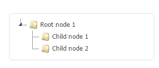

##jstree 说明文档

[官方网站](https://www.jstree.com/)

###Getting Started - everything at a glance

**1.Download jsTree**

All the files you need are in the dist/ folder of the download.

**2.Include a jsTree theme**

Themes can be autloaded too, but it is best for performance to include the CSS file.
```css
<link rel="stylesheet" href="dist/themes/default/style.min.css" />
```

**3.Setup a container**

This is the element where you want the tree to appear, a `<div>` is enough. This example has `a` nested `<ul>` as there is no other `data source` configured (such as JSON).
```html
  <div id="jstree_demo_div"></div>
```

**4.Include jQuery**

jsTree requires 1.9.0 or greater in your webpage.
```html
<script src="dist/libs/jquery.js"></script>

```

**5.Include jsTree**

For production include the minified version: dist/jstree.min.js, there is a development version too: dist/jstree.js
```html
<script src="dist/jstree.min.js"></script>
```

**6.Create an instance**

Once the DOM is ready you can start creating jstree instances.
```javascript
$(function () { $('#jstree_demo_div').jstree(); });
```

**7.Listen for events**

jsTree uses events to notify you when something changes while users (or you) interact with the tree. So binding to jstree events is as easy binding to a click. There is a **list of events** and what information they provide in the API documentation.
```javascript
$('#jstree_demo_div').on("changed.jstree", function (e, data) {
  console.log(data.selected);
});
```

**8.Interact with your instances**

Once an instance is ready you can invoke methods on it. There is a list of available methods in the API documentation. The three examples below do exactly the same thing
```javascript
$('button').on('click', function () {
  $('#jstree').jstree(true).select_node('child_node_1');
  $('#jstree').jstree('select_node', 'child_node_1');
  $.jstree.reference('#jstree').select_node('child_node_1');
});
```

###完整测试代码
```html
<!DOCTYPE html>
<html>
<head>
  <meta charset="utf-8">
  <title>jsTree test</title>
  <!-- 2 load the theme CSS file -->
  <link rel="stylesheet" href="dist/themes/default/style.min.css" />
</head>
<body>
  <!-- 3 setup a container element -->
  <div id="jstree">
    <!-- in this example the tree is populated from inline HTML -->
    <ul>
      <li>Root node 1
        <ul>
          <li id="child_node_1">Child node 1</li>
          <li>Child node 2</li>
        </ul>
      </li>
      <li>Root node 2</li>
    </ul>
  </div>
  <button>demo button</button>

  <!-- 4 include the jQuery library -->
  <script src="dist/libs/jquery.js"></script>
  <!-- 5 include the minified jstree source -->
  <script src="dist/jstree.min.js"></script>
  <script>
  $(function () {
    // 6 create an instance when the DOM is ready
    $('#jstree').jstree();
    // 7 bind to events triggered on the tree
    $('#jstree').on("changed.jstree", function (e, data) {
      console.log(data.selected);
    });
    // 8 interact with the tree - either way is OK
    $('button').on('click', function () {
      $('#jstree').jstree(true).select_node('child_node_1');
      $('#jstree').jstree('select_node', 'child_node_1');
      $.jstree.reference('#jstree').select_node('child_node_1');
    });
  });
  </script>
</body>
</html>
```


## Configuring instances

Creating an instance as described in the overview does not modify any of the defaults:

```javascript
$('#jstree').jstree();
```

You can change the defaults for all future instances:
```javascript
$.jstree.defaults.core.themes.variant = "large";
$('#jstree').jstree();
```

But most of the time you will want to change the defaults only for the instance that is being created. This is achieved by passing in a config object when creating the instance:

```javascript
$('#jstree').jstree({
  "plugins" : [ "wholerow", "checkbox" ]
});
```

As seen in the previous example - there is one special key in the config object named plugins. It is an array of strings, which contain the names of the plugins you want active on that instance.

All options that do not depend on a plugin are contained in a key of the config object named core, the options for each plugin are contained within a key with the same name as the plugin:
```javascript
$('#jstree').jstree({
  "core" : {
    "themes" : {
      "variant" : "large"
    }
  },
  "checkbox" : {
    "keep_selected_style" : false
  },
  "plugins" : [ "wholerow", "checkbox" ]
});
```

You can have a look at all the options and their default values. This list is what you can configure on each instance.

For example, by default the tree allows multiple selection as stated in `$.jstree.defaults.core.multiple`, to overwrite that make sure your config object contains` "core" : { "multiple" : false }`. If you have multiple overrides for the same key (like `"core"` here), group them:
```javascript
$("#jstree").jstree({
  "core" : {
    "multiple" : false,
    "animation" : 0
  }
});
```

##Populating a tree using HTML

**Basic markup**

jsTree can turn a regular unordered list into a tree. The minimal required markup is a `<ul>` node with some nested `<li>` nodes with some text inside.

You should have a container wrapping the `<ul>` and create the instance on that container. Like so:
```javascript
$('#html1').jstree();.
```

```html
<div id="html1">
  <ul>
    <li>Root node 1</li>
    <li>Root node 2</li>
  </ul>
</div>
```


**Nodes with children**

To create a node with child nodes simpy nest an `<ul>`.

Internally jstree converts the text to a link, so if there already is a link in the markup jstree won't mind. Like `Child node 2`.
Clicking on the link however will not direct the user to a new page, to do that - intercept the `changed.jstree` event and act accordingly.

Keep reading for the section on handling events.
```html
<div id="html1">
  <ul>
    <li>Root node 1
      <ul>
        <li>Child node 1</li>
        <li><a href="#">Child node 2</a></li>
      </ul>
    </li>
  </ul>
</div>
```



**Setting initial state with classes**

To make a node initially selected you can set the `jstree-clicked` class on the `<a>` element.

Similarly you can set the `jstree-open` class on any `<li>` element to make it initially extended, so that its children are visible.

It is a good idea to give your nodes unique IDs by adding the `id` attribute to any `<li>` element. This will be useful if you need to sync with a backend as you will get the ID back in any events jstree triggers.
```html
…
<li class="jstree-open" id="node_1">Root</li>
  <ul>
    <li>
      <a href="#" class="jstree-clicked">Child</a>
    </li>
  </ul>
</li>
…
```


**Setting initial state with data attribute**

You can also set the state on a node using a `data-jstree` attribute.

You can use any combination of the following: `opened`, `selected`, `disabled`, `icon`.

Specifying an address (anything containing a `/`) will display that image as the node icon. Using a string will apply that class to the `<i>` element that is used to represent the icon.
For example if you are using Twitter Bootstrap you can use `"icon" : "glyphicon glyphicon-leaf" `to display a leaf icon.
```html
<li data-jstree='{"opened":true,"selected":true}'>Root
  <ul>
    <li data-jstree='{"disabled":true}'>Child</li>
    <li data-jstree='{"icon":"//jstree.com/tree.png"}'>
      Child</li>
    <li data-jstree='{"icon":"glyphicon glyphicon-leaf"}'>
      Child</li>
  </ul>
</li>
```


**Loading with AJAX**

You can also use AJAX to populate the tree with HTML your server returns. The format remains the same as the above, the only difference is that the HTML is not inside the container, but returned from the server.

To take advantage of this option you need to use the `$.jstree.defaults.core.data` config option.

Just use a standard jQuery-like AJAX config and jstree will automatically make an AJAX request populate the tree with the response.

Add a class of `jstree-closed` to any LI node you return and do not nest an UL node and jstree will make another AJAX call as soon as the user opens this node.

In addition to the standard jQuery ajax options here you can supply functions for `data` and `url`, the functions will be run in the current instance's scope and a param will be passed indicating which node is being loaded, the return value of those functions will be used as URL and data respectively.

```html
$('#tree').jstree({
'core' : {
  'data' : {
    'url' : 'ajax_nodes.html',
    'data' : function (node) {
      return { 'id' : node.id };
    }
  }
});

// Example response:
<ul>
<li>Node 1</li>
<li class="jstree-closed">Node 2</li>
</ul>
```


##Populating the tree using JSON

The format

jsTree needs a specific format to work with JSON. In the standard syntax no fields are required - pass only what you need. Keep in mind you will be able to access any additional properties you specify - jsTree won't touch them and you will be able to use them later on.

To change the icon of the node use the `icon` property. Specifying a string containing a / will display that image as the node icon. Using any other string will apply that class to the `<i>` element that is used to represent the icon. You can use boolean `false` to make jsTree render the node with no icon.

You can set the state on a node using the `state` property. Use any combination of the following: `opened`, `selected`, `disabled`.

Both `li_attr` and `a_attr` are passed directly to jQuery's attr function.

When using AJAX set `children` to boolean `true` and jsTree will render the node as closed and make an additional request for that node when the user opens it.

Any nested children should either be objects following the same format, or plain strings (in which case the string is used for the node's text and everything else is autogenerated).
```javascript
// Expected format of the node (there are no required fields)
{
  id          : "string" // will be autogenerated if omitted
  text        : "string" // node text
  icon        : "string" // string for custom
  state       : {
    opened    : boolean  // is the node open
    disabled  : boolean  // is the node disabled
    selected  : boolean  // is the node selected
  },
  children    : []  // array of strings or objects
  li_attr     : {}  // attributes for the generated LI node
  a_attr      : {}  // attributes for the generated A node
}
```

**Alternative JSON format**

If you do not want to use the nested `children` approach, you can use the alternative syntax where each node object has two required fields: `id` & `parent` and no `children` property (everything else remains the same).

jsTree will automatically build the hierarchy. To indicate a node should be a root node set its `parent` property to `"#"`.

This should be used mainly when you render the whole tree at once and is useful when data is stored in a database using adjacency.
```javascript
// Alternative format of the node (id & parent are required)
{
  id          : "string" // required
  parent      : "string" // required
  text        : "string" // node text
  icon        : "string" // string for custom
  state       : {
    opened    : boolean  // is the node open
    disabled  : boolean  // is the node disabled
    selected  : boolean  // is the node selected
  },
  li_attr     : {}  // attributes for the generated LI node
  a_attr      : {}  // attributes for the generated A node
}
```

**Using JSON**

To populate the tree with a JSON object you need to use the `$.jstree.defaults.core.data` config option.

The expected format is an array of nodes, where each node should be an object as described above or a simple string (in which case the string is used for the node's text property and everything else is autogenerated). Any nested nodes are supplied in the same manner in the `children` property of their parent.
```javascript
$('#using_json').jstree({ 'core' : {
    'data' : [
       'Simple root node',
       {
         'text' : 'Root node 2',
         'state' : {
           'opened' : true,
           'selected' : true
         },
         'children' : [
           { 'text' : 'Child 1' },
           'Child 2'
         ]
      }
    ]
} });
```

**Using the alternative JSON format**
```javascript
$('#using_json_2').jstree({ 'core' : {
    'data' : [
       { "id" : "ajson1", "parent" : "#", "text" : "Simple root node" },
       { "id" : "ajson2", "parent" : "#", "text" : "Root node 2" },
       { "id" : "ajson3", "parent" : "ajson2", "text" : "Child 1" },
       { "id" : "ajson4", "parent" : "ajson2", "text" : "Child 2" },
    ]
} });
```

**Using AJAX**

You can also use AJAX to populate the tree with JSON your server returns. The format remains the same as the above, the only difference is that the JSON is not inside the config object, but returned from the server.

To take advantage of this option you need to use the `$.jstree.defaults.core.data` config option.

Just use a standard jQuery-like AJAX config and jstree will automatically make an AJAX request populate the tree with the response.

In addition to the standard jQuery ajax options here you can supply functions for `data` and `url`, the functions will be run in the current instance's scope and a param will be passed indicating which node is being loaded, the return value of those functions will be used as URL and data respectively.

If you do not return correct json headers from the server, at least set the `dataType` jQuery AJAX option to `"json"`.
```javascript
$('#tree').jstree({
'core' : {
  'data' : {
    'url' : function (node) {
      return node.id === '#' ? 
        'ajax_roots.json' : 
        'ajax_children.json';
    },
    'data' : function (node) {
      return { 'id' : node.id };
    }
  }
});
    
```

**Using a function**

You can supply a function too. That function will receive two arguments - the node being loaded and a callback function to call with the children for that node once you are ready.

```javascript
$('#tree').jstree({
    'core' : {
        'data' : function (obj, cb) {
            cb.call(this,
              ['Root 1', 'Root 2']);
        }
    }});
```

##Listening for events

jsTree triggers various events on the container. You can review the list of all events to know what to listen for.

To get more information about the event inspect its `data` argument.

In most cases where a node is involved you will get the whole node object passed in. If you get an ID string somewhere and want to inspect the node just use `.get_node()`.

```javascript

$('#jstree')
  // listen for event
  .on('changed.jstree', function (e, data) {
    var i, j, r = [];
    for(i = 0, j = data.selected.length; i < j; i++) {
      r.push(data.instance.get_node(data.selected[i]).text);
    }
    $('#event_result').html('Selected: ' + r.join(', '));
  })
  // create the instance
  .jstree();    

```
## Invoking methods on an instance

To invoke a method on an instance you must obtain a reference of the instance and invoke the method. The example shows how to obtain a reference and invoke a method.

Check the API for a list of available methods.
```javascript
// 3 ways of doing the same thing
$('#jstree').jstree(true)
  .select_node('mn1');
$('#jstree')
  .jstree('select_node', 'mn2');
$.jstree.reference('#jstree')
  .select_node('mn3');
```

##[API文档](https://www.jstree.com/api/)  

##Plugins?

jsTree has some functionality moved out of the core so you can only use it when you need it. To enable a plugin use the `plugins` config option and add that plugin's name to the array.

For example enabling all the plugins can be done this way:

```javascript
"plugins" : [ "checkbox", "contextmenu", "dnd", "massload", "search", "sort", "state", "types", "unique", "wholerow" ]
```

Here is a quick overview for each one.
### Checkbox plugin
This plugin renders checkbox icons in front of each node, making multiple selection much easier. 
It also supports tri-state behavior, meaning that if a node has a few of its children checked it will be rendered as undetermined, and state will be propagated up. You can also fine tune the cascading options with the cascade config option.
Keep in mind when cascading checkbox will check even disabled nodes.

Undetermined state is automatically calculated, but if you are using AJAX and loading on demand and want to render a node as underemined pass `"undetermined" : true` in its state.

You can find all the checkbox plugin config options in the API.
```javascript
$(function () {
  $("#plugins1").jstree({
    "checkbox" : {
      "keep_selected_style" : false
    },
    "plugins" : [ "checkbox" ]
  });
});
```

### Contextmenu plugin

This plugin makes it possible to right click nodes and shows a list of configurable actions in a menu.

You can find all the contextmenu plugin config options in the API.
```javascript
$(function () {
  $("#plugins2").jstree({
     "core" : {
       // so that create works
       "check_callback" : true
     },
    "plugins" : [ "contextmenu" ]
  });
});
```

### Drag & drop plugin

This plugin makes it possible to drag and drop tree nodes and rearrange the tree.

You can find all the dnd plugin config options in the API.
```javascript
$(function () {
  $("#plugins3").jstree({
    "core" : {
      "check_callback" : true
    },
    "plugins" : [ "dnd" ]
  });
});
```

### Massload plugin
This plugin makes it possible to load nodes in a single request (used with lazy loading).

You can find all the massload plugin config options in the API.
```javascript
$(function () {
  $("#plugins10").jstree({
    "core" : {
      "data" : { .. AJAX config .. }
    },
    "massload" : {
      "url" : "/some/path",
      "data" : function (nodes) {
        return { "ids" : nodes.join(",") };
      }
    }
    "plugins" : [ "massload", "state" ]
  });
});
```

### Search plugin

This plugin adds the possibility to search for items in the tree and even to show only matching nodes.

You can find all the search plugin config options in the API.
```javascript
$(function () {
  $("#plugins4").jstree({
    "plugins" : [ "search" ]
  });
  var to = false;
  $('#plugins4_q').keyup(function () {
    if(to) { clearTimeout(to); }
    to = setTimeout(function () {
      var v = $('#plugins4_q').val();
      $('#plugins4').jstree(true).search(v);
    }, 250);
  });
});
```


###Sort plugin

This plugin automatically arranges all sibling nodes according to a comparison config option function, which defaults to alphabetical order.
```javascript
$(function () {
  $("#plugins5").jstree({
    "plugins" : [ "sort" ]
  });
});
```

### State plugin

This plugin saves all opened and selected nodes in the user's browser, so when returning to the same tree the previous state will be restored.

You can find all the state plugin config options in the API. Make a selection and refresh this page to see the change persisted.
```javascript
$(function () {
  $("#plugins6").jstree({
    "state" : { "key" : "demo2" },
    "plugins" : [ "state" ]
  });
});
```

### Types plugin

This plugin makes it possible to add predefined types for groups of nodes, which means to easily control nesting rules and icon for each group.

To set a node's type you can use `set_type` or supply a `type` property with the node's data.

You can find all the types plugin config options & functions in the API.
```javascript
$(function () {
  $("#plugins7").jstree({
    "types" : {
      "default" : {
        "icon" : "glyphicon glyphicon-flash"
      },
      "demo" : {
        "icon" : "glyphicon glyphicon-ok"
      }
    },
    "plugins" : [ "types" ]
  });
});
```


### Unique plugin
Enforces that no nodes with the same name can coexist as siblings. This plugin has no options, it just prevents renaming and moving nodes to a parent, which already contains a node with the same name.
```javascript
$(function () {
  $("#plugins8").jstree({
    "core" : {
      "check_callback" : true
    },
    "plugins" : [ "unique", "dnd" ]
  });
});
```

### Wholerow plugin

Makes each node appear block level which makes selection easier. May cause slow down for large trees in old browsers.
```javascript
$(function () {
  $("#plugins9").jstree({
    "plugins" : [ "wholerow" ]
  });
});
```
